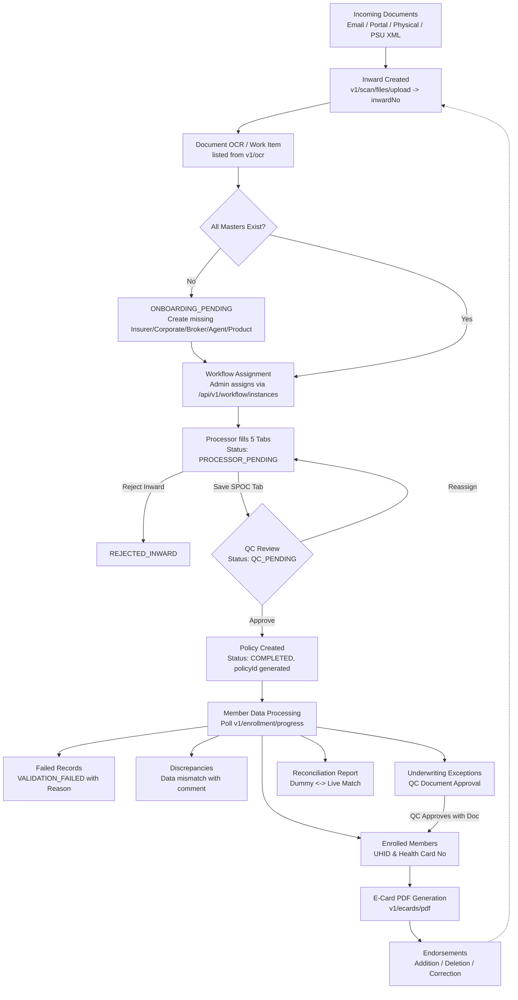
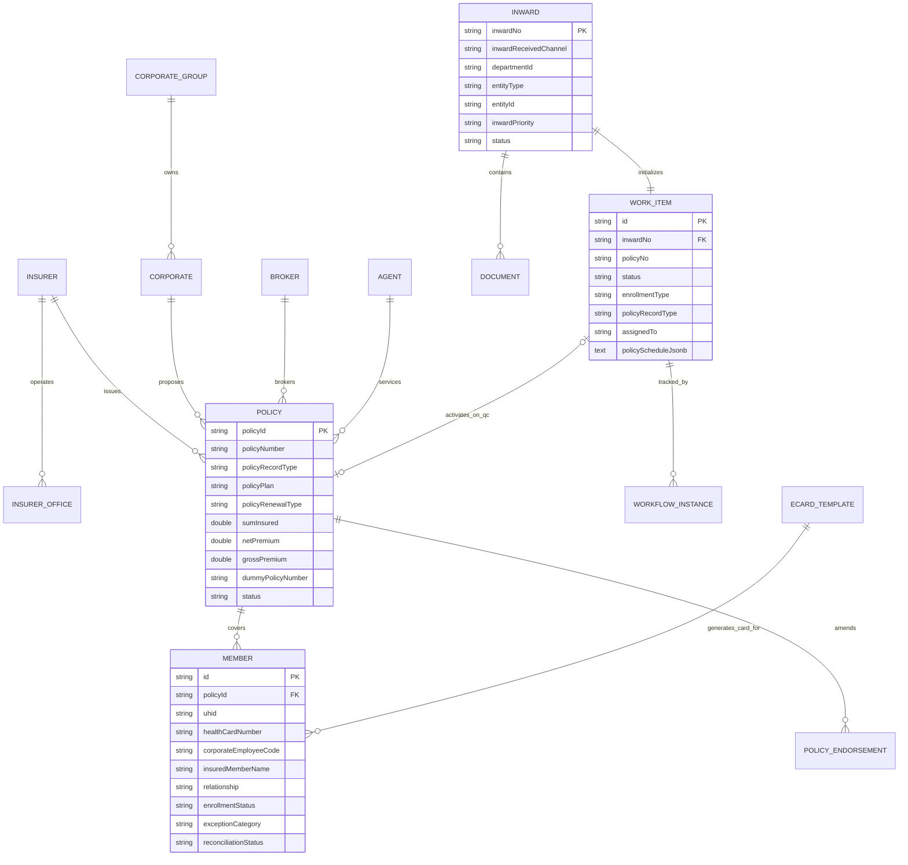

# MD India Enrollment System — Microservices Architecture

Comprehensive technical architecture for the **MD India Health Insurance TPA Enrollment System**, built with **Java 21**, **Spring Boot 3.3**, **PostgreSQL**, **Apache Kafka (KRaft)**, and **Apache APISIX API Gateway**.

---

## 1. Executive Summary & Business Objective

The **MD India Enrollment System** handles the end-to-end lifecycle of corporate group health insurance policies. It transforms insurer policy documents (PDF/XML) and corporate employee/dependant rosters (Excel) into fully active, operational policy and member records within MD India's servicing engine.

### Core Governance & Separation of Duties
- **Maker-Checker Governance**:
  - **Processor (Maker)**: Inputs corporate policy terms across 5 structured tabs (*Insurer*, *Corporate*, *Policy*, *Broker*, *SPOC*). Work is saved tab-by-tab with status `PROCESSOR_PENDING`.
  - **QC User (Checker)**: Verifies terms and holds sole authority to make a policy live (`v1/enroll/policy/QC` -> `COMPLETED`).
  - **The Hinge**: Policy creation occurs strictly upon QC Approval. Approval returns the generated `policyId`, immediately triggering member roster evaluation and card generation.

---

## 2. End-to-End Business Flow



---

## 3. Microservices Decomposition

The system is decomposed into 6 independent Spring Boot microservices and 1 shared domain library:

```
Learning-Java/
├── pom.xml                                   # Root Maven POM (Java 21, Spring Boot Parent)
├── docker-compose.yml                        # Docker stack (APISIX, Postgres, Kafka, Services)
├── ARCHITECTURE.md                           # Comprehensive Architecture Reference
├── README.md                                 # Quick Start and Developer Guide
├── test-system.ps1                           # PowerShell End-to-End Verification Script
├── test-system.sh                            # Bash End-to-End Verification Script
├── docker/
│   └── apisix/
│       ├── config.yaml                       # APISIX Gateway Core Config
│       └── apisix.yaml                       # Dynamic Upstreams & Route Table
├── common-domain/                            # Shared Library
│   ├── dto/                                  # ApiResponse, PageResponse, PolicyScheduleDto, etc.
│   ├── enums/                                # Statuses, Relationships, Channels, Types
│   └── events/                               # PolicyApprovedEvent, MemberProcessingEvent
├── master-service/                           # Port 8081: Masters & User Directory
├── inward-service/                           # Port 8082: Inwards, Uploads & PSU XML Parser
├── policy-service/                           # Port 8083: OCR Work Items, Tabs & QC Approval
├── workflow-service/                         # Port 8084: Task Assignment & State Transitions
├── member-service/                           # Port 8085: Members, Exceptions & Reconciliation
└── ecard-service/                            # Port 8086: Card Customization & PDF Generation
```

### Service Directory & Port Map

| Service Name | Port | Description | Frontend Axios Client |
|---|---|---|---|
| **master-service** | `8081` | Insurers, Offices, Corporates, Groups, Brokers, Agents, Plan Types, Document Master & User Assignment Groups | `masterApi`, `corporateApi`, `brokerApi`, `agentApi`, `userService` |
| **inward-service** | `8082` | Inward registration, S3 document uploads, presigned download URLs, PSU XML file metadata | `inwardGenerateApi`, `documentApi`, `documentApi2`, `parseService` |
| **policy-service** | `8083` | OCR work items (`/v1/ocr`), Processor tab draft saves, QC Review & Approval, Policy search, Dummy policy search, Endorsements | `policySearchApi` |
| **workflow-service** | `8084` | Workflow instances, Maker/Checker role transitions, workload cards, queue listings | `workFlow` |
| **member-service** | `8085` | Member roster processing, progress polling (`/v1/enrollment/progress`), failed rows, discrepancies, exception approvals, reconciliation reports | `memberData`, `memberService` |
| **ecard-service** | `8086` | E-card templates, customization (label limits <= 15 chars), preview, real PDF rendering | `eCardService` |

---

## 4. API Gateway Route Matrix (Apache APISIX : 9080)

APISIX routes incoming requests directly to the corresponding service upstreams:

| Inbound Route Pattern | Upstream Service | Port | Responsible Frontend Features |
|---|---|---|---|
| `/v1/corporate-group*`<br/>`/v1/corporates*`<br/>`/v1/brokers*`<br/>`/v1/agents*`<br/>`/v1/insurer*`<br/>`/v1/plan-types*`<br/>`/v1/documentmaster*`<br/>`/api/v1/groups*`<br/>`/api/v1/users*` | `master-service` | `8081` | Master Data management, dropdown lookups, assignment user resolution |
| `/v1/files/inwards*`<br/>`/v1/scan/files*`<br/>`/v1/files/presigned-url*`<br/>`/v1/generateId/inwardno*`<br/>`/v1/xml-parser*` | `inward-service` | `8082` | Inward registration, document uploads, error report downloads, PSU XML imports |
| `/v1/ocr*`<br/>`/v1/policy-endorsements*`<br/>`/v1/enroll/policy*`<br/>`/v1/policies*` | `policy-service` | `8083` | Work item draft storage (`policyScheduleJsonb`), tab transitions, QC approval, policy search |
| `/api/v1/workflow*` | `workflow-service` | `8084` | Assignment transitions (`MANUAL_ASSIGN_PROCESSOR`, `MANUAL_ASSIGN_QC`), stage counts |
| `/v1/enrollment/progress*`<br/>`/v1/member*`<br/>`/v1/members*` | `member-service` | `8085` | Member progress polling, enrolled roster, failed rows, exceptions, reconciliation |
| `/v1/ecards*` | `ecard-service` | `8086` | Template configuration, label previews, dynamic PDF generation |

---

## 5. Domain Model & ER Diagram



---

## 6. The Policy Draft Architecture (`policyScheduleJsonb`)

During the **Processor Workflow**, the policy does not yet exist in the database table `policies`. Instead, it is incrementally built across 5 tabs into a single unified JSON object (`policyScheduleJsonb`):

1. **`icObject`**: Insurer selection, insurer type (`PSU` vs `PRIVATE`), product, issuing/regional/divisional offices.
2. **`corporateObject`**: Proposer details, Corporate Group, corporate PAN, corporate GSTIN, HR contact.
3. **`policyObject`**: Contract terms, Plan (`INDIVIDUAL`, `FAMILY_FLOATER`, `GROUP`), Renewal type, Policy period, Sum Insured, Net & Gross Premium, Co-payment, Corporate buffer, Dummy policy linking (`linkDummyNumber`, `dummyPolicyNumber`), physical cards and welcome mailer flags.
4. **`policyFamilyDefinitionRules`**: Structured eligibility rules validating who may be covered:
   - `PRIMARY_MEMBER`: Mandatory, 1-1 count, age 18-70 (`SELF`, `EMPLOYEE`).
   - `SPOUSE`: 0-1 count, age 18-70 (`SPOUSE`, `HUSBAND`, `WIFE`).
   - `CHILD`: 0-4 count, age 0-25 (`SON`, `DAUGHTER`, `CHILD`).
   - `SIBLING`: 0-4 count, age 18-65 (`BROTHER`, `SISTER`).
   - `PARENT` / `IN_LAW`: Age ranges 45-90 (`FATHER_MOTHER`, `ANY_2`, `ANY_4`, `ONE_SET`, `IN_LAW`).
5. **`brokerAgentObject`**: Channel type (`BROKER`, `AGENT`, `DIRECT`), broker/agent IDs and codes.
6. **`tpaSpocObject`**: TPA servicing branch, TPA SPOC contact details, Client HR contact details.

Upon QC approval, `policy-service` parses `policyScheduleJsonb`, persists the live `PolicyEntity`, and emits events triggering member data processing.

---

## 7. Status Lifecycles

| Lifecycle Family | States | Transitions & Triggers |
|---|---|---|
| **Work Item Status** | `ONBOARDING_PENDING`, `PROCESSOR_PENDING`, `QC_PENDING`, `REASSIGNED`, `COMPLETED`, `REJECTED_INWARD` | Missing masters -> `ONBOARDING_PENDING`<br/>Processor tab saves -> `PROCESSOR_PENDING`<br/>Save on SPOC tab -> `QC_PENDING`<br/>QC Approve -> `COMPLETED`<br/>QC Reassign -> `REASSIGNED` |
| **Workflow Status** | `PENDING`, `COMPLETED`, `REJECTED` | Driven by actions: `MANUAL_ASSIGN_PROCESSOR`, `MANUAL_ASSIGN_QC` |
| **Member Status** | `ENROLLED`, `VALIDATION_FAILED`, `DISCREPANCY`, `EXCEPTION` | Clean rows -> `ENROLLED`<br/>Format/age violation -> `VALIDATION_FAILED`<br/>HR payroll mismatch -> `DISCREPANCY`<br/>Underwriting rule breach -> `EXCEPTION` (requires QC document approval) |
| **Reconciliation Status** | `EXISTING_MEMBER_MATCHED`, `NEW_ENROLLED`, `MEMBER_DELETED`, `PARTIAL_MISMATCH` | Reconciles dummy policy members against live policy roster |

---

## 8. Verification & Test Execution

Run the automated test script to verify end-to-end functionality across all microservices:

```powershell
.\test-system.ps1
```

Or under Linux/Bash:
```bash
chmod +x test-system.sh
./test-system.sh
```
